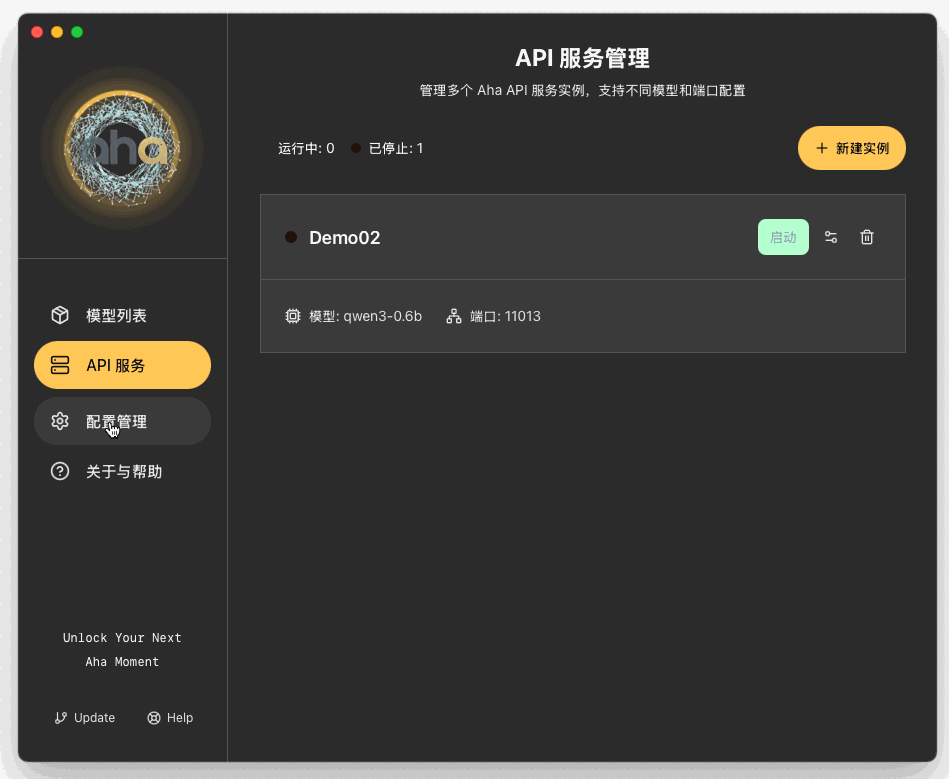

<p align="center">
  
</p>

<p align="center">
  <a href="https://github.com/go-restream/Uaha/stargazers">
    
  </a>
  <a href="https://github.com/go-restream/Uaha/issues">
    
  </a>
  <a href="https://github.com/go-restream/Uaha/blob/main/LICENSE">
    
  </a>
</p>

<p align="center">
  <a href="README.md">English</a> | 简体中文
</p>

<h1 align="center">Uaha</h1>

<p align="center">
  <b>现代化 AI 模型服务管理桌面应用</b>
</p>

<p align="center">
  基于 Aha 引擎，使用原生技术构建的跨平台桌面应用，提供简洁直观的界面来管理 AI 模型和 API 服务。
</p>

<p align="center">
  
</p>

---

## 📢 更新日志

### v0.1.0-beta (2026-02-10)

#### 🎉 首个公开 Beta 版本

**核心功能**:
- 模型管理：浏览、下载、删除 AI 模型，支持实时进度显示
- API 服务管理：创建、启动、停止多个模型服务实例
- 配置管理：Aha 路径配置、模型下载设置、主题切换
- 跨平台架构：基于 Wails v3 原生技术栈

**平台支持**:
- macOS ✅ | Windows 🚧 | Linux 🚧

[查看完整更新日志 →](docs/changelog.md)

---

## 🚀 快速开始

### 安装

1. **下载安装包** - 访问 [GitHub Releases](https://github.com/go-restream/Uaha/releases)
2. **运行安装程序** - 按照平台提示完成安装
3. **启动应用** - 首次运行配置 Aha 引擎路径

### 从源码构建

```bash
# 克隆仓库
git clone https://github.com/go-restream/Uaha.git && cd Uaha

# 构建应用
wails3 build
wails3 package GOOS=darwin

```

[详细安装指南 →](docs/getting-started.md)

---

## ✨ 主要特性

- **模型管理** - 一键下载和管理 AI 模型，实时进度跟踪
- **服务管理** - 创建和管理多个 API 服务实例，支持资源监控
- **配置灵活** - 丰富的自定义选项，包括主题和外观设置
- **跨平台** - 支持 macOS、Windows、Linux 等主流操作系统
- **现代化 UI** - 基于 Vue 3 和 Tailwind CSS 构建的美观界面

---

## 📚 文档

| 文档 | 描述 |
|------|------|
| [快速入门](docs/getting-started.md) | 安装与首次配置指南 |
| [用户指南](docs/user-guide.md) | 功能详细使用说明 |
| [开发指南](docs/development.md) | 架构设计与开发贡献 |
| [常见问题](docs/faq.md) | FAQ 与故障排除 |
| [更新日志](docs/changelog.md) | 版本历史 |

---

## 🛠️ 技术栈

| 类别 | 技术 |
|------|------|
| **后端** | Go 1.25+ |
| **框架** | Wails v3 |
| **前端** | Vue 3 + Vite |
| **样式** | Tailwind CSS |
| **状态** | Pinia |

---

## 🤝 贡献指南

欢迎贡献！请查看 [CONTRIBUTING.md](CONTRIBUTING.md) 文件以了解如何贡献。

---

## 📄 许可证

本项目采用 Apache 2.0 许可证 - 查看 [LICENSE](LICENSE) 文件了解详情。

---

## 🔗 相关链接

- [Wails v3 文档](https://v3.wails.io)
- [Aha 引擎](https://github.com/jhqxxx/aha)
- [问题反馈](https://github.com/go-restream/Uaha/issues)

---

<p align="center">
  <b>Uaha</b> © 2025 xiaoyang · Built with ❤️ and Wails
</p>
